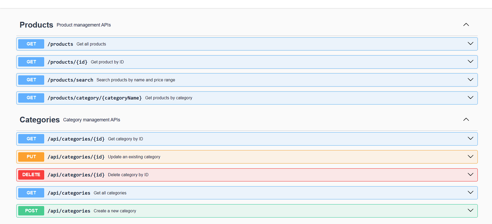
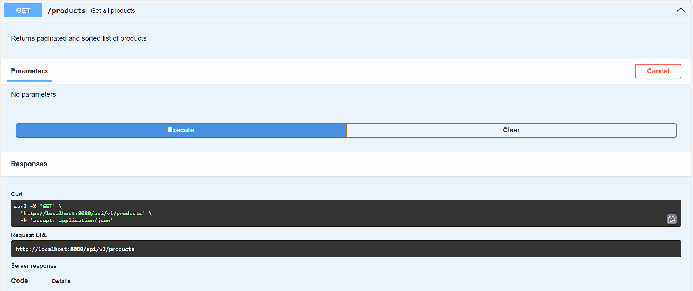
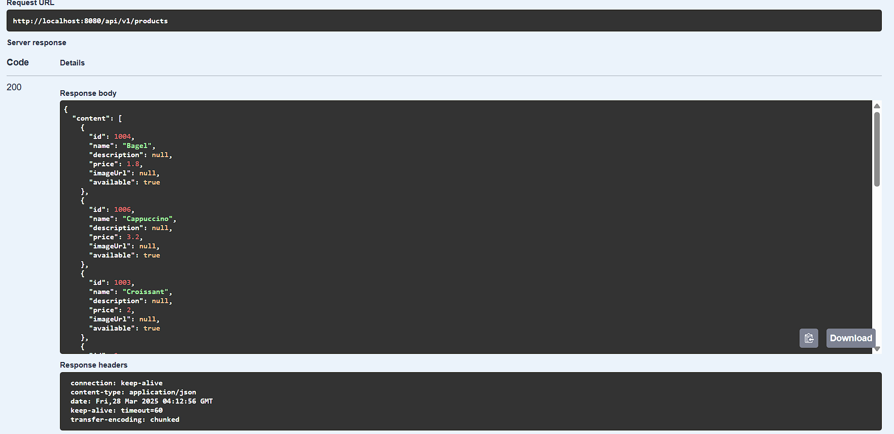
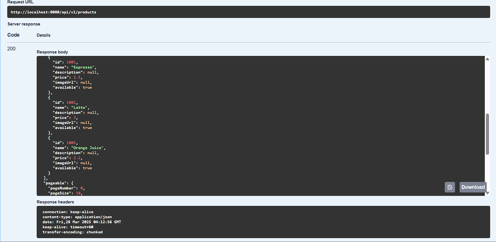
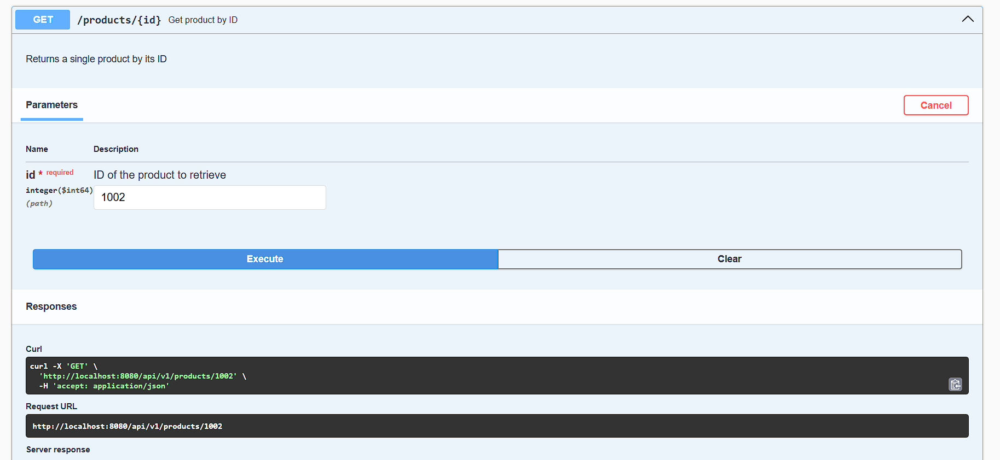
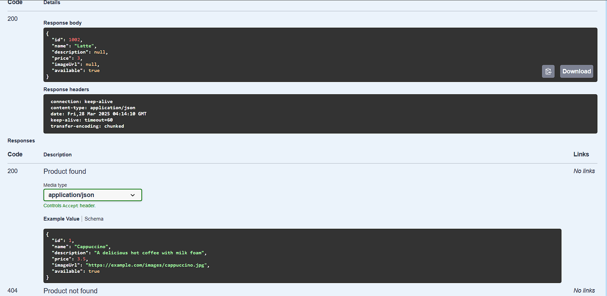

Отчёт по лабораторной работе

Краткое описание выполненных заданий

В рамках лабораторной работы выполнены следующие задачи:

Разработан REST API для управления товарами и категориями в кофейне.

Реализована пагинация и сортировка при получении списка товаров.

Настроена автоматическая генерация миграций с помощью Liquibase.

Добавлена документация API с использованием Swagger.

Реализована обработка исключений через @ControllerAdvice.

Применены принципы SOLID, включая инверсию зависимостей.

Скриншоты работающего приложения
Swagger UI:

Скриншоты выполнения

Пояснения к реализации (SOLID)
Single Responsibility (Принцип единственной ответственности):

Каждый класс выполняет одну задачу. Например:

ProductService — управляет бизнес-логикой работы с продуктами.

ProductController — отвечает за REST API.

ProductRepository — взаимодействует с БД.

Open-Closed (Принцип открытости/закрытости):

Код открыт для расширения, но закрыт для модификации.

Например, добавление новых типов фильтрации не требует изменения ProductService, а только создания новых методов в ProductRepository.

Liskov Substitution (Принцип подстановки Барбары Лисков):

Использование DTO вместо моделей гарантирует, что клиентский код (Controller) не зависит от внутренней структуры БД.

Interface Segregation (Принцип разделения интерфейсов):

Внедрены раздельные сервисы для работы с Product и Category.

Нет «больших» интерфейсов с ненужными методами.

Dependency Inversion (Принцип инверсии зависимостей):

Использован интерфейс ProductService, а не конкретная реализация (JpaProductService).

Это делает код менее зависимым от деталей реализации и позволяет легко менять ProductService на другую реализацию (например, MongoProductService).

Ответы на вопросы
Как вы применили принцип инверсии зависимостей?

В коде используются интерфейсы для сервисов (ProductService, CategoryService).

Конкретные реализации (JpaProductService) передаются через Spring Dependency Injection.

Как организована структура пакетов в приложении и почему?

com.coffeeshop

├── controller    # REST-контроллеры

├── service       # Логика приложения

├── repository    # Репозитории Spring Data JPA

├── model         # JPA-сущности (БД)

├── dto           # DTO-объекты для передачи данных

├── mapper        # MapStruct-мапперы (из Entity в DTO)

├── exception     # Глобальная обработка ошибок

Такое разделение упрощает поддержку кода, делает его логически структурированным и понятным.

Какие преимущества дает использование DTO объектов?

Скрытие деталей БД — контроллеры не зависят от структуры таблиц.

Безопасность — можно передавать только нужные поля, исключая, например, password.

Гибкость — один и тот же ProductDTO можно использовать в разных контекстах (например, AdminProductDTO, UserProductDTO).

